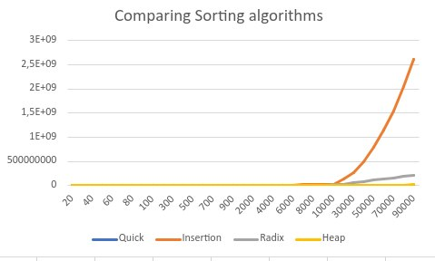
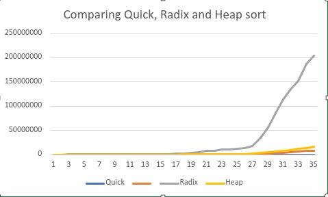

    Comparing sorting algorithms: insertion, quick, radix and heap sort

<link rel="preconnect" href="https://fonts.googleapis.com">
<link rel="preconnect" href="https://fonts.gstatic.com" crossorigin>
<link href="https://fonts.googleapis.com/css2?family=Raleway:wght@100&family=Roboto:wght@100;300&display=swap" rel="stylesheet">

## 1. Introduction 

    Today, we will compare four of the mentioned in title sorting algorithms, and decide, which
    one is the fastest.

## 1.1 Quick sort

### Algorithm 

Quick sort based on <b>Divide and Conquer</b>  algorithm. It takes some
number, which will be compared to another numbers. If number <b><i>n</i></b>
is bigger than our pivot, then we put <b><i>n</i></b> on the right of pivot.
This part in quick sort is called partition. On each side (left and right) call
partition, to properly 
 
In another case, number <b><i>n</i></b> is lower than pivot, then, we put it 
on the left side. 
 

### Time complexity

 
    &emsp;&emsp;  1. The best time complexity for algorithm is Ω (N log (N)). 
    Best case for quick sort algorithm, is when the taken pivot divides
    an array into two equal parts. Since it make two balanced partitions, leading to
    effective sorting.
     
    &emsp;&emsp; 2. Average case time complexity θ ( N log (N)). 
     
    &emsp;&emsp; 3. The worst case is actually not so bad. Various techniques were invented
in order to prevent worst case in quick sort algorithm. The worst case in quick sort is 
when array is already sorted, and a pivot is either the smallest, or the greatest value. 
Techniques, which are used to prevent such cases are using randomized quick sort,
and choosing a pivot, which is average of 3 elements in array.

    

## 1.2 Insertion sort

### Algorithm

Insertion sort is a simple sorting algorithm, which iterates through an array, comparing elements
and moving the bigger one closer to the end. 
 
When inserting an element <b><i>n</i></b> into an array, it runs through each element, which is lower than 
<b><i>n</i></b>. When it finds an element, which is bigger than <b><i>n</i></b>, it exits. If no element found, it 
will be at the last position - the biggest number in the array. 
 

### Time complexity

Time complexity of insertion sort: 
    &emsp;&emsp; 1. The best case - array with numbers in ascending order. Since we do not need to swap any numbers, we do not spend time on it.
     
    &emsp;&emsp; 2. The average insertion sort time complexity is 0(n^2)
     
    &emsp;&emsp; 3. The worst time complexity in insertion sort is 0(n^2)

 
Additional little bonus, is easy to implement.

## 1.3 Heap sort

### Algorithm

Heap sort is comparison-based algorithm as well. First of all, it creates max binary heap
from the given array. Next, it swaps the biggest element of the heap (it is called root), with the
the last one. After that, we know that last element is already on proper place, and operate on array,
which now has size len(array)-1. Heapifying array, swapping root with last element, removing, heapifying, swapping..

### Time complexity

Heap sort does not have best and worst cases. It's average time complexity is O(N log N), which is 
effective for large arrays.

## 1.4 Radix sort

### Algorithm

Radix sort is non-comparitive sorting algorithm. It does not use direct comparison to verify 
if one number is bigger than another. Instead, it creates so-called 'buckets', and puts
there elements, based on their radix. The more significant digits has number, the more 
repeatings will be needed to finish bucketing process. 
 
It has two variations: sorting by least significant digit and most significant digit.
In both variations, we firstly search for either smallest, or biggest value, and based on their radix,
compare, and swap them. Comparing by radix numbers with one another, we eventually will get the sorted array.

### Time complexity

Radix has a time complexity of O(d * (n + b)), where d is the number of digits, 
n is the number of elements, and b is the base of the number system being used.

## Methodology

The all 4 algorithms were implemented in Golang. The results were generated for
randomly filled array, with range of values from [1, 591257512]. 
 
Results contains average amount of sorting time (in milliseconds) per array size.
Each array size was tested 10-100 times.

## Results

Graphics and results for the average case of all sorting algorithms are listed
below. Values have been taken as average from 10 results.
 

From the first graph we can see that insertion sort takes much more time than all 
another 3 algorithms all together. Let's take a look more detailed at Quick,
Heap, and Radix sort comparison.

From graph below we can see that Insertion sort is slower than each of these sorts at least in 500 times.

  

From graph below, we can see that quick sort average time is nearly the same as in heap sort.
Radix sort, however, takes a lot more time compared to quick and heap.
 

# Conclusion

Quick sort is the fastest sorting algorithm, while insertion is the slowest.

